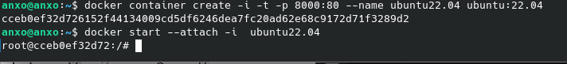
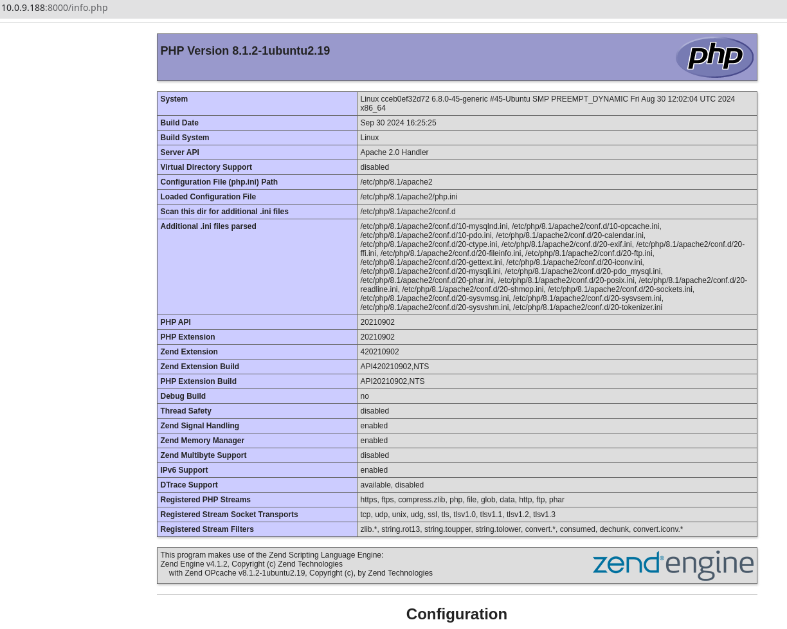
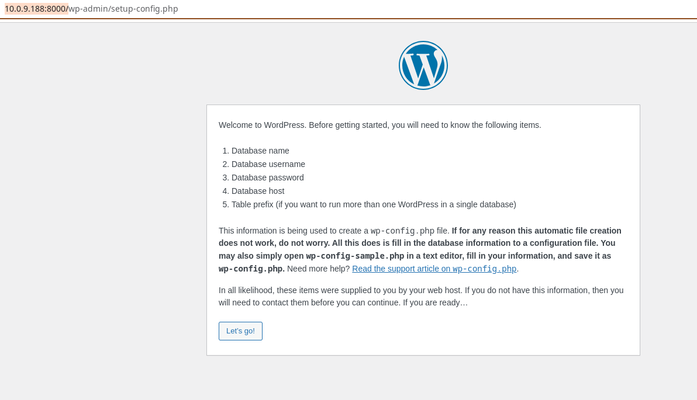
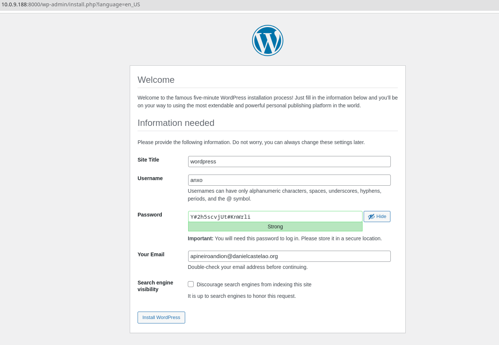
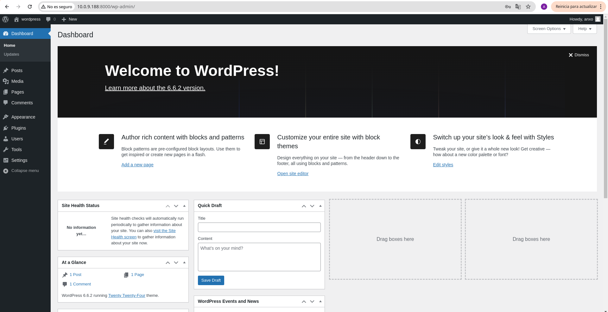

# SXE_Tarea04
## Angel Jose Piñeiro Andion
### Enunciado:
#### Crear un  fichero (nombre "Readme.md") con formato markdown en un repositorio en github para subir este fichero y hacer commits que indiquen lo realizado.

#### En la respuesta pon el enlace a tu repositorio en github

#### 1. Utiliza la imagen de Ubuntu , tag 22 y apoyandote en esta guía sigue sus instrucciones para instalar LAMP en dicho contenedor.

En primer lugar vamos a descargar la imagen de Ubuntu 22.04 utilizando el siguiente comando:

    docker pull ubuntu:22.04

Una vez descargada la imagen, vamos a crear un contenedor con la misma utilizando el siguiente comando:

    docker container create -i -t -p 8000:80 --name ubuntu22.04 ubuntu:22.04

Una vez creado el contenedor lo arrancamos con el siguiente comando:

    docker start --attach -i  ubuntu22.04 



Una vez dentro vamos a instalar la pila LAMP siguiendo los siguientes pasos:
1. Actualizamos los paquetes del sistema:

        apt update

2. Instalamos Apache:

        apt install -y apache2 apache2-utils

3. Instalamos mariadb:

        apt install -y mariadb-server mariadb-client

4. Iniciamos maria db, y configuramos la contraseña de root:

        service mariadb start
        mysql_secure_installation
      
   Aqui nos pedira la contraseña de root, la cual dejaremos en blanco, y luego nos pedira que la cambiemos, la cambiamos y le damos a todo a "Y" para que configure el resto de opciones.


5. Instalamos PHP:
    
         apt install -y php php-mysql libapache2-mod-php

6. Probamos que funciona:

    echo \"\<?php phpinfo(); ?>\" | tee /var/www/html/info.php

7. Iniciamos apache:

        service apache2 start

   Accedemos al navegador con la sigueinte ruta:

   http://10.0.9.188:8000/info.php

   

#### 2. Utiliza esta guía para instalar wordpress en el contenedor.

Para instalar wordpress en el contenedor, vamos a seguir los siguientes pasos:

1. Instalamos las dependencias: (ALgunas de ellas ya estan instaladas, pero como no supone un problema copiaremos el scrip directamente de la guia)

        apt update
         apt install apache2 \
         ghostscript \
         libapache2-mod-php \
         mysql-server \
         php \
         php-bcmath \
         php-curl \
         php-imagick \
         php-intl \
         php-json \
         php-mbstring \
         php-mysql \
         php-xml \
         php-zip
2. Instalamos wordpress:

         mkdir -p /srv/www
         chown www-data: /srv/www
         curl -o https://wordpress.org/latest.tar.gz
         tar zx -C /srv/www -f latest.tar.gz

3. Configuramos apache para WordPress:

         touch /etc/apache2/sites-available/wordpress.conf
         nano /etc/apache2/sites-available/wordpress.conf

   Dentro del archivo pegamos el siguiente contenido:

        <VirtualHost *:80>
            ServerAdmin webmaster@localhost
            DocumentRoot /srv/www/wordpress
            ServerName wordpress.local
            ServerAlias www.wordpress.local
            <Directory /srv/www/wordpress>
                Options FollowSymLinks
                AllowOverride All
                Require all granted
            </Directory>
            ErrorLog ${APACHE_LOG_DIR}/error.log
            CustomLog ${APACHE_LOG_DIR}/access.log combined
        </VirtualHost>

   Habilita el sitio con:

            a2ensite wordpress
            service apache2 reload

   Habilita la reescritura de URL con:

       a2enmod rewrite

   Deshabilita el sitio predeterminado "It Works" con:

         a2dissite 000-default

   Reinicia Apache con:

         service apache2 restart

4. Configuramos la base de datos (POR UN ERROR TUVE QUE REINSTALAR MARIADB EN ESTE PASO):

         mysql -u root -p
         CREATE DATABASE wordpress;
         CREATE USER 'anxo' IDENTIFIED BY '1234';
         GRANT SELECT, INSERT, UPDATE, DELETE, CREATE, DROP, ALTER ON wordpress.* TO 'anxo';
         FLUSH PRIVILEGES;
         QUIT;

5. Configuramos WordPress:

   Accedemos desde el navegador a http://10.0.9.188:8000/

    

6. wp-config:
   
   Creamos el archivo de configuración de WordPress:

         touch /srv/www/wordpress/wp-config.php
         nano /srv/www/wordpress/wp-config.php

    Dentro del archivo pegamos el siguiente contenido:

  ```` 
  <?php
/**
   * The base configuration for WordPress
     *
     * The wp-config.php creation script uses this file during the installation.
     * You don't have to use the website, you can copy this file to "wp-config.php"
     * and fill in the values.
     *
     * This file contains the following configurations:
     *
 * * Database settings
 * * Secret keys
 * * Database table prefix
 * * ABSPATH
   *
     * @link https://developer.wordpress.org/advanced-administration/wordpress/wp-config/
     *
     * @package WordPress
     */

// ** Database settings - You can get this info from your web host ** //
/** The name of the database for WordPress */
define( 'DB_NAME', 'wordpress' );

/** Database username */
define( 'DB_USER', 'anxo' );

/** Database password */
define( 'DB_PASSWORD', '1234' );

/** Database hostname */
define( 'DB_HOST', 'localhost' );

/** Database charset to use in creating database tables. */
define( 'DB_CHARSET', 'utf8mb4' );

/** The database collate type. Don't change this if in doubt. */
define( 'DB_COLLATE', '' );

/**#@+
 * Authentication unique keys and salts.
   *
   * Change these to different unique phrases! You can generate these using
   * the {@link https://api.wordpress.org/secret-key/1.1/salt/ WordPress.org secret-key service}.
   *
   * You can change these at any point in time to invalidate all existing cookies.
   * This will force all users to have to log in again.
   *
   * @since 2.6.0
   */
define( 'AUTH_KEY',         's[u1wXGyctU,mlo?e]@9oF8H5 2TvN{cXIW$Bka$2y1mHiewl^#wbs?5^w}bqiZV' );
define( 'SECURE_AUTH_KEY',  '%c|p_{W18!)`0Z-;$o[0_Gw!>FcjP,lRJXi/M1[?#>o0:p[@su$]P=DIR}$BqjG(' );
define( 'LOGGED_IN_KEY',    'G.ui.lm42ILdmyeWLg)~:rO,6o`gkUeDKq9]$7x$snYHW6!I0>A3cRK~!x ]` z<' );
define( 'NONCE_KEY',        '[xUHnT-um:]H;X._l7p_#J!T3M`Iy]Od%%.*ImS~2_Z{?s)2t). 6GQie0,;Y!n4' );
define( 'AUTH_SALT',        '_p7zJt7xK1O6Ap{&J,a#2{eFlCLKi*ZMw3A!1bR#WT?@srOmM$e);X<+ia]<`b?a' );
define( 'SECURE_AUTH_SALT', '%3{{P[$)R5dLwk=uE3NcPo]`;f`ND5oO!@E.cc9`.X/Qgz719lt.0uP:UuB56CKu' );
define( 'LOGGED_IN_SALT',   '8x&Xtei=>P#7NI@f,yGOS7-9V}LMKS/-X^UiVLzKlV8GQBv8%I[#f7^nP^~N/7N3' );
define( 'NONCE_SALT',       'OLK3Lg|^p|&<p~{{B8@g%t/a}wXpV(R(HETQ7Y1o}YiW&@[a#%4Gs1|b*j?RoZ1.' );

/**#@-*/

/**
 * WordPress database table prefix.
   *
   * You can have multiple installations in one database if you give each
   * a unique prefix. Only numbers, letters, and underscores please!
   */
$table_prefix = 'wp_';

/**
 * For developers: WordPress debugging mode.
   *
   * Change this to true to enable the display of notices during development.
   * It is strongly recommended that plugin and theme developers use WP_DEBUG
   * in their development environments.
   *
   * For information on other constants that can be used for debugging,
   * visit the documentation.
   *
   * @link https://developer.wordpress.org/advanced-administration/debug/debug-wordpress/
   */
define( 'WP_DEBUG', false );

/* Add any custom values between this line and the "stop editing" line. */


/* That's all, stop editing! Happy publishing. */

/** Absolute path to the WordPress directory. */
if ( ! defined( 'ABSPATH' ) ) {
	define( 'ABSPATH', __DIR__ . '/' );
}

/** Sets up WordPress vars and included files. */
require_once ABSPATH . 'wp-settings.php';
````
         
   


#### 3. Comprueba que puedes acceder a wordpress.

Finalente logeamos en wordpress con las credenciales que creamos en el paso 4 de la instalación de wordpress.



#### OPCIONAL: Instala phpmyadmin en el contenedor siguiendo esta guía. Comprueba que puedes acceder.